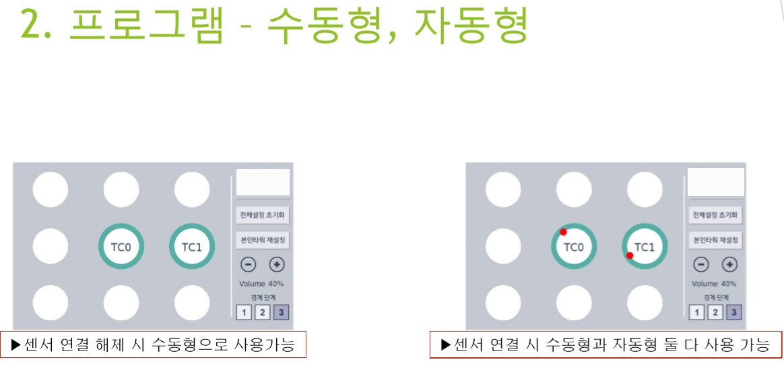

# 충돌방지 프로그램
## 프로젝트 소개
- 공사현장에서 각기 다른 타워 크레인이 움직일 때 충돌이 발생하는 사고를 사전에 방지하기 위해 제작되었습니다. 지자기/자이로센서와 지그비 모듈, 사운드 센서, processing을 사용하여 모든 구현을 담당하였습니다.
- 지자기센서로 타워 크레인이 움직이는 각도를 계산하고 그 각도를 지그비 모듈을 이용하여 서로 통신하면서 서로 충돌할 위험이 있는 각도에 도달했을 때 경고음을 들려줍니다. 사용자 본인이 다른 타워에게 경고음을 전달할 수도 있게 구현되었습니다.
- 주파수가 겹치는 일을 막기 위해 프로그램 내에서 지그비 모듈의 채널을 변경하는 기능도 구현되어있습니다.
- 사전에 타워 크레인의 위치도를 보며 위치를 사전설정해주고, 타워 크레인의 전원을 이용하여 라즈베리파이로 구동합니다. 라즈베리파이의 터치스크린을 이용하여 터치로 모든 동작이 가능합니다.  

</img>
</img>
</img>
</img>
</img>
</img>
</img>
</img>
</img>
